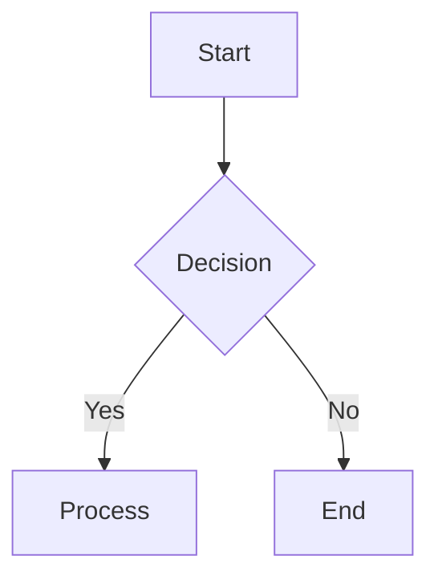

# MD to PDF Converter

A lightweight, client-side Markdown to PDF converter. No server required - runs entirely in your browser.

**[Try it online](https://zabio3.github.io/md-to-pdf/)**

## Features

- Real-time Markdown preview
- PDF export with customizable options
- **Mermaid diagram support** (flowcharts, sequence diagrams, etc.)
- Page breaks support (`<!-- pagebreak -->`)
- Paper size selection (A4, Letter, Legal, A3, A5)
- Margin adjustment
- Font size control
- GitHub Flavored Markdown support

## Usage

### Online

Visit **https://zabio3.github.io/md-to-pdf/**

### Local Development

```bash
# Clone the repository
git clone <repo-url>
cd md-to-pdf

# Start a local server
python3 -m http.server 8080

# Open in browser
open http://localhost:8080
```

### Page Breaks

Insert page breaks in your Markdown using HTML comments:

```markdown
# Page 1 Content

<!-- pagebreak -->

# Page 2 Content
```

Note: `---` is rendered as a horizontal rule (standard Markdown behavior).

### Mermaid Diagrams

Create diagrams using Mermaid syntax in fenced code blocks:

````markdown

````

Supported diagram types:
- Flowcharts
- Sequence diagrams
- Class diagrams
- State diagrams
- Entity Relationship diagrams
- And more ([Mermaid documentation](https://mermaid.js.org/intro/))

Mermaid rendering can be toggled on/off in **Settings > 詳細設定 > Mermaidダイアグラムを描画**.

### Keyboard Shortcuts

- `Ctrl/Cmd + S`: Export to PDF

## Tech Stack

- Vanilla JavaScript (no frameworks)
- [Marked.js](https://marked.js.org/) - Markdown parsing
- [Mermaid.js](https://mermaid.js.org/) - Diagram rendering
- [html2pdf.js](https://ekoopmans.github.io/html2pdf.js/) - PDF generation
- GitHub Pages - Hosting

## Deployment

The site automatically deploys to GitHub Pages when pushing to the `main` branch via GitHub Actions.

### Manual Setup

1. Go to repository **Settings** > **Pages**
2. Under "Build and deployment", select **GitHub Actions** as the source
3. Push to main branch to trigger deployment

## License

MIT
